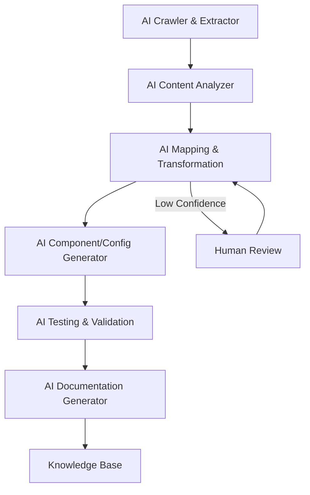

Assessment — Puck for an intranet backed by a headless CMS

- Summary
  - Puck is a React-first visual editor that serializes page structure as JSON (content/root/zones) and exposes render/preview components and plugin hooks. It is designed to integrate into React apps (Next.js, Remix, React Router) and supports custom components, plugins, field transforms, and migrations — all useful for an intranet editor backed by a headless CMS.

- Strengths
  - Visual, component-driven editing: editors manipulate React component instances, so the WYSIWYG experience can match your real site.
  - Extensible: plugins, overrides, and field transforms let you adapt UI and serialization to CMS schemas.
  - Multiple integration recipes (Next.js/Remix/react-router) and examples (PuckPreview, Render, Puck.Components) speed prototyping.
  - Lightweight data model (JSON) makes storing page state in a headless CMS or database straightforward.
  - Docs show route auth examples and mention server API patterns you’ll need.

- Limitations / risks
  - Not a full CMS: Puck is an editor/UI layer. You must implement storage, permissions, versioning, workflows, localization, and audit trails in the headless CMS or in extra services.
  - Collaboration / concurrent edits: no built-in realtime merging; requires extra engineering for multi-user editing.
  - Authoring vs. content model mismatch: mapping rich component JSON to normalized CMS content (for downstream APIs) may require adapters/plugins.
  - Security: editor routes and save APIs must be protected (docs explicitly call out adding auth).
  - SEO / SSR: ensure server rendering or static generation reads Puck JSON and renders correct markup for intranet search/indexing.

- Recommended architecture (concise)
  1. Frontend: Next.js (or Remix) app integrates Puck for /edit routes and exposes PuckPreview/Render for live preview.
  2. Storage: store the Puck JSON as a page document in a headless CMS (or DB) with fields: slug, puckData (JSON), metadata, version, author, updatedAt.
  3. API layer: server endpoints to load/save Puck JSON; enforce auth+RBAC on /edit and save routes (docs show this pattern).
  4. Publishing: implement publish workflow that copies Puck JSON to a production-read model or triggers static regeneration.
  5. Plugins/adapters: build field transforms and plugins to map Puck component fields to CMS fields where necessary.
  6. Operations: backups, migrations (use Puck’s migrate examples), monitoring, and caching for performance.

- Quick feasibility checklist (POC scope)
  - [ ] Create POC with npx create-puck-app and chosen framework
  - [ ] Implement API routes to load/save Puck JSON to your headless CMS
  - [ ] Add auth middleware for /edit and save endpoints
  - [ ] Build 5–10 real components as Puck component configs mapped to CMS fields
  - [ ] Implement publish flow and test SSR/preview rendering
  - [ ] Add versioning/audit trail and test migration flow

- Minimal save handler example (TypeScript)
```typescript
// typescript
// POST /api/pages/save — receives Puck JSON and persists to headless CMS
export async function POST(req: Request) {
  const body = await req.json(); // { slug, puckData, author }
  // example: call your CMS API or DB layer
  await cmsClient.savePage(body.slug, {
    puckData: body.puckData,
    meta: { author: body.author, updatedAt: new Date().toISOString() },
  });
  return new Response(JSON.stringify({ ok: true }), { status: 200 });
}
```

- Recommendation
  - Use Puck as the visual editing layer for an intranet if you want component-driven WYSIWYG editing and are prepared to build the storage, auth, publishing, and collaboration layers on top. It’s a good fit for intranets where pages are React-component-centric and you control the platform stack. For heavy editorial workflows (complex approvals, multi-stage localization, real-time collaboration) expect additional engineering.
# AI-First Migration Plan: Liferay to Puck-Based Intranet

## 1. Migration Strategy Overview

- **AI-Driven**: All legacy content and structure will be discovered, extracted, and mapped using AI-powered crawling, analysis, and transformation tools.
- **No Backend Access**: All data must be obtained via web crawling, scraping, and intelligent parsing.
- **API-Ready**: The new intranet will leverage custom APIs for authentication, access control, authoring, approval, audit logging, and content serving.

## 2. AI-Powered Discovery & Extraction

- Develop or configure an AI-enabled crawler to:
  - Traverse all accessible legacy intranet pages (respecting permissions).
  - Extract page content, metadata, navigation, media, and document links.
  - Use LLMs to classify page types, extract structured data, and identify relationships (menus, hierarchies, cross-links).
  - Catalog extracted content in a temporary data store for analysis.

## 3. Content Analysis, Cataloging & Mapping

- Use AI/ML to:
  - Cluster and categorize content (news, policies, forms, landing pages, etc.).
  - Map legacy layouts/components to Puck-compatible React components.
  - Identify reusable content blocks and templates.
  - Generate a content inventory and migration mapping document.

## 4. Puck-Based Intranet Architecture

- **Frontend**: Next.js/Remix app with Puck for editing and preview.
- **APIs**: Custom endpoints for content CRUD, authentication, RBAC, workflow, audit, and publishing.
- **Storage**: Headless CMS or DB for Puck JSON, metadata, and versioning.
- **Plugins/Adapters**: For field transforms, content normalization, and workflow integration.
- **Security**: Auth middleware, RBAC, audit logging, and secure API endpoints.

## 5. Implementation Steps

- Build AI-powered crawler and extraction pipeline.
- Catalog and map legacy content to new data model.
- Develop core intranet app with Puck integration.
- Implement required APIs (auth, access, authoring, approval, audit, content).
- Migrate and transform content into the new system.
- Build and test editorial workflows, publishing, and preview.
- Harden security and access controls.

## 6. Testing & Validation

- Validate completeness and fidelity of migrated content.
- Test editorial, approval, and publishing workflows.
- Verify permissions, audit logging, and API security.
- Conduct user acceptance testing (UAT) with stakeholders.

## 7. Documentation & Handover

- Document migration process, architecture, and custom components.
- Provide user/admin guides for the new intranet.
- Deliver migration mapping and content inventory.
- Handover operational runbooks and support materials.

## 8. Next Steps

- Review and refine this plan.
- Approve for implementation.

---
# AI-First Migration Plan (Full AI Automation)

## 1. AI-Driven Migration Principles

- **AI at Every Stage**: All migration phases are automated with AI/ML, with human review only for exception handling or critical QA.
- **Continuous Learning**: AI models are fine-tuned iteratively using feedback from extraction, mapping, and validation phases.
- **Human-in-the-Loop**: Only invoked for ambiguous or failed cases flagged by AI confidence thresholds.

---

## 2. AI-Powered Crawling & Extraction

- Autonomous AI agents crawl, render, and interact with the legacy intranet, simulating user journeys.
- LLMs and vision models extract:
  - Page content, structure, metadata, navigation, media, and embedded documents.
  - Dynamic content and forms via AI-driven browser automation.
- AI classifies and tags content types, relationships, and permissions.

---

## 3. AI-Based Content Analysis, Cataloging & Mapping

- LLMs cluster, categorize, and deduplicate content.
- AI maps legacy layouts/components to Puck-compatible React components, generating config and migration scripts.
- Automated detection of reusable blocks, templates, and content patterns.
- AI builds a content inventory, migration mapping, and transformation rules.

---

## 4. AI-Driven Data Transformation & Migration

- AI transforms extracted data into Puck JSON and metadata, auto-generating component configs and field mappings.
- Automated validation of data integrity and completeness.
- AI scripts handle bulk import into the new CMS or DB, flagging anomalies for review.

---

## 5. AI-Generated Components, Configs & Workflows

- LLMs generate initial React component code, Puck configs, and editorial workflow templates from analyzed legacy patterns.
- AI proposes access control, approval, and audit logic based on extracted business rules.
- Automated test generation for new components and workflows.

---

## 6. AI-Driven Testing, Validation & QA

- AI agents perform regression, visual, and functional testing of migrated content and workflows.
- LLMs compare legacy and new site outputs, flagging discrepancies.
- Automated UAT simulation using AI-generated user personas and scenarios.

---

## 7. AI-Generated Documentation & Knowledge Base

- LLMs auto-generate migration documentation, user/admin guides, and technical runbooks from migration logs and configs.
- AI builds a searchable knowledge base from extracted and transformed content.

---

## 8. Exception Handling & Human Review

- Only content or mappings below AI confidence thresholds are queued for human review.
- All exceptions are logged and summarized for efficient triage.

---

## 9. Continuous Improvement Loop

- Feedback from validation and human review is used to retrain and improve AI models for future migrations.

---

**Mermaid Diagram:**


---
## AI-Centric Architecture & Workflow Updates

- **End-to-End AI Orchestration**: All migration, transformation, and validation steps are coordinated by an AI workflow engine.
- **Autonomous Agents**: Specialized AI agents handle crawling, extraction, mapping, transformation, testing, and documentation, communicating via a shared orchestration layer.
- **Confidence-Driven Routing**: All outputs are scored for confidence; only low-confidence cases are routed to human review queues.
- **Continuous Feedback Loop**: AI models are retrained using feedback from validation and human review, improving accuracy over time.
- **API Integration**: All AI outputs (content, configs, tests, docs) are delivered via APIs to the new Puck-based intranet stack.
- **Audit & Traceability**: Every AI action is logged, versioned, and traceable for compliance and rollback.

---